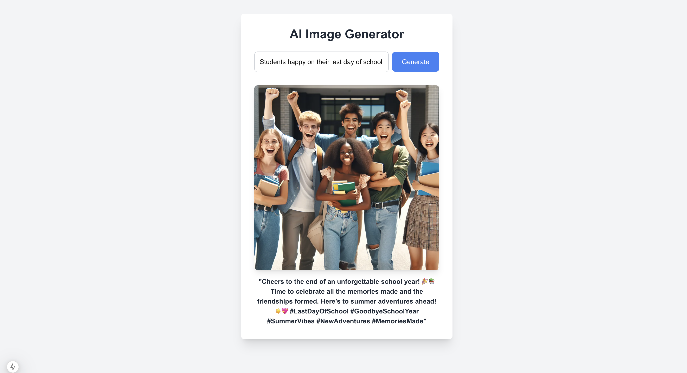

# Image Caption Generator App

Welcome to the **Image Caption Generator App**! This app allows you to generate unique images and captions using OpenAI's powerful models, **DALL-E 3** for image generation and **GPT-4** for caption creation.

## Features

- **Image Generation**: The app uses OpenAI's **DALL-E 3** model to generate high-quality, creative images based on your input prompts.
- **Caption Generation**: After generating an image, the app uses **GPT-4 Mini** to generate a creative caption with hashtags that describes the generated image.

## Screenshot

Here is an example of how the app looks when generating an image and caption:

